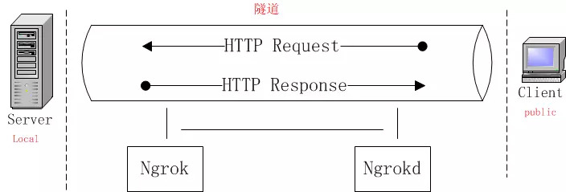
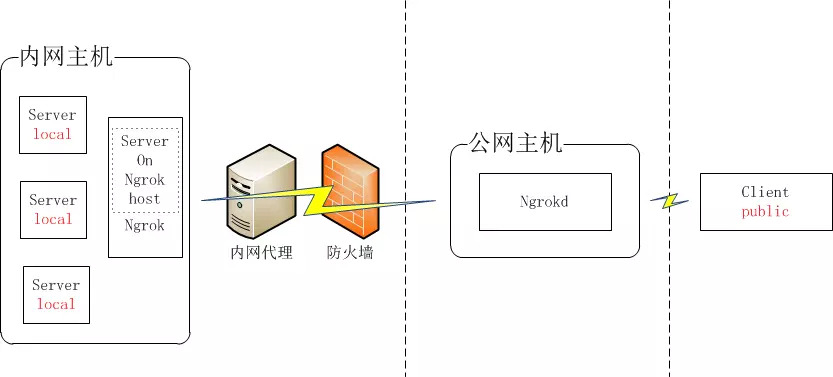

# 开发之痛

由于公网ip资源的匮乏，我们日常开发中经常需要将系统部署到服务器之后才能测试或演示支付等特定功能，而由此引发的调试问题更是时常让工程师们头疼不已。今天给大家介绍一个可以极大改善这一问题的工具-ngrok。这是一个让你能够在自己的开发机器上使用公网地址的效率神器。

# 内网网穿透

在介绍ngrok之前我们需要先理解一个概念，就是内网穿透，内网穿透，又叫NAT穿透，是ipv4协议下由于地址稀缺而延伸出来的技术。一般情况下在非局域网中，您的朋友要访问您电脑上的资源，需要您的电脑拥有一个独立的ip地址，用于找到您的电脑在互联网中的位置。但是现在ip稀缺，电信运营商已经不会随便分配固定ip给个人。通常实现内网穿透，是通过路由器上端口映射来实现的。但是路由器通常不是每个人都有权限可以访问和设置，而且可能存在多级路由器较为复杂的网络结构，单纯的端口映射也无法实现公网的资源暴露。这就需要ngrok来实现了。

# 常用工具介绍

- ngrok https://ngrok.com 也提供内网穿透服务，不过由于总所周知的原因，我们在国内几乎没有办法正常使用。
- 花生壳 国内个人用户可以试着玩一下，不过动态域名和网络速度限制也让其实用性大打折扣
- 自建ngrok 这个也是我个人比较推荐的一种做法，这种方式能满足绝大多数临时系统和测试系统的使用，但是千万不要在生产环境中使用，毕竟路层级太多会导致太多不可预知的问题。


# 自建ngrok

## 原理

ngrok建立一个隧道，将主机A的http请求传递给主机B，从而实现内网穿透。ngrok分为client端(ngrok)和服务端(ngrokd)。



实际使用中的部署如下：



图中内网主机上安装客户端。公网主机安装服务端。client public则代表访问你电脑的用户或者朋友。

## 安装过程

- 这里推荐使用docker形式进行安装，原生形式安装需要管理ngrok进程，无论在公网主机还是内网主机上直接将进程暴露在主机上都不是一个很好的选择。所以个人推荐使用docker进行安装。

### 生成证书
#### 自签证书
```shell
cd /ngrok/
export NGROK_DOMAIN="ngrok.xxxx.com"
openssl genrsa -out rootCA.key 2048
openssl req -x509 -new -nodes -key rootCA.key -subj "/CN=$NGROK_DOMAIN" -days 5000 -out rootCA.pem
openssl genrsa -out device.key 2048
openssl req -new -key device.key -subj "/CN=$NGROK_DOMAIN" -out device.csr
openssl x509 -req -in device.csr -CA rootCA.pem -CAkey rootCA.key -CAcreateserial -out device.crt -days 5000
```

#### 这里的证书也可以使用certbot签发的证书，在测试微信支付等需要https访问的方式是十分有用的
```shell
docker run -it --rm --name certbot \
    -v "$PWD/etc_letsencrypt:/etc/letsencrypt" \
    -v "$PWD/lib_letsencrypt:/var/lib/letsencrypt" \
    certbot/certbot certonly -d "*.xxxx.com" -d "xxxx.com" --manual --preferred-challenges dns-01  --server https://acme-v02.api.letsencrypt.org/directory
```

### 创建ngrok配置文件

创建ngrok.cfg文件
```
server_addr: "ngrok.xxxx.com:5553" # 这里需要提前配置好相应域名解析
trust_host_root_certs: false
tunnels:
  app:
    subdomain: "dev-api"
    proto:
      http: "docker.for.mac.host.internal:5000"
```

### 创建dockerfile文件

```
FROM golang
RUN git clone https://github.com/inconshreveable/ngrok.git /ngrok
WORKDIR /ngrok
COPY lieju.vip/chain.pem assets/client/tls/ngrokroot.crt
COPY lieju.vip/fullchain.pem /cert.pem
COPY lieju.vip/privkey.pem /priv.key
RUN make release-client release-server
COPY ngrok.cfg /ngrok/ngrok.cfg
```

### 创建docker-compose.yaml

```
version: '3'
services:
  # ngrok
  client:
    build:
      context: .
    command: ./bin/ngrok -config=/ngrok/ngrok.cfg start-all
    restart: always
  server:
    build:
      context: .
    command: ./bin/ngrokd -tlsKey=/priv.key -tlsCrt=/cert.pem -domain="lieju.vip" -httpAddr=":80" -httpsAddr=":443" -tunnelAddr=":5553"
    restart: always
    ports:
      - "443:443"
      - "80:80"
      - "5553:5553"
```

## 部署

将整个目录打包分别复制到两个主机

在公网主机上运行

```
docker-compose up -d server
```

在内网主机上运行

```
docker-compose up -d client
```