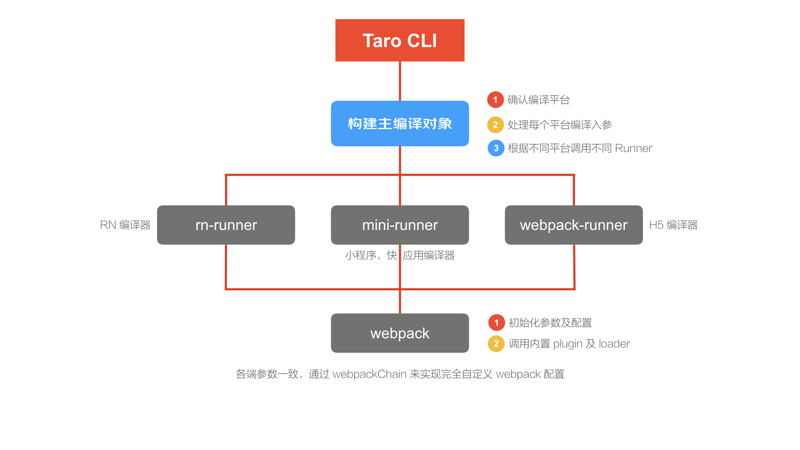

# taro2.0 小程序开发神兵利器

# 第三方小程序框架对比 
- WEPY 腾讯团队开源的一款类vue语法规范的小程序框架,借鉴了Vue的语法风格和功能特性,支持了Vue的诸多特征，比如父子组件、组件之间的通信、computed属性计算、wathcer监听器、props传值、slot槽分发，还有很多高级的特征支持：Mixin混合、拦截器等; 也是历史最悠久的第三方小程序开发框架，官方背书，vue风格下小程序开发的不二之选。
- mpvue 美团团队开源项目，虽然github的star不少，但是个人觉得项目基本处于停滞状态，基本没有人维护的状态，也算是一手好牌，打烂了～学习可以看看，不建议使用。还有一些类似于uni-app之类的“商业开源”项目也建议考虑清楚在使用，毕竟项目中途换框架还是很让人郁闷的～
- taro 我们今天的主角，react风格下的“唯一”选择，京东这些年比较成功的一个开源项目，issue的处理还是很及时的。

# taro介绍

多端统一开发框架，支持用 React 的开发方式编写一次代码，生成能运行在微信/百度/支付宝/字节跳动/ QQ 小程序/快应用/H5/React Native 等的应用。（官方介绍）

Taro 1.x 版本自2018年9月份发布

Taro 2.x 正式版本2020年1月发布

Taro 在不到两年的时间里一直保持高速成长，发布了多个具有重大意义的版本，让Taro成为如今一个功能完善，拥有众多忠实拥趸的多端统一开发框架。

虽然taro框架号称一次编写，多端运行，不过在实际操作过程中还是很不建议大家这样搞的，受限于各端的实际情况，可以通用一些组件尚且不易，更不要说通用整个项目了。

# taro2.0变化

## 编译构建

这部分也是taro2.0要更新大版本的主要原因，原来 Taro CLI 的编译构建系统是他们自己搞的，后来发现很多时候自己搞的轮子实在是没有现成的轮子好用，所以转投了Webpack。虽然新对于我们一般的小项目而言变化不大，不过为以后的扩展提供了更好的社区兼容性。



## 异步编程调整

Taro 2.0 中开启 async functions 支持不再需要安装 @tarojs/async-await，而是直接通过 babel 插件来获得支持。

在项目根目录下安装包 babel-plugin-transform-runtime 和 babel-runtime。
```
yarn add babel-plugin-transform-runtime --dev
yarn add babel-runtime
```
随后修改项目 babel 配置，配置插件 babel-plugin-transform-runtime。
```
babel: {
  sourceMap: true,
  presets: [['env', { modules: false }]],
  plugins: [
    'transform-decorators-legacy',
    'transform-class-properties',
    'transform-object-rest-spread',
    ['transform-runtime', {
      "helpers": false,
      "polyfill": false,
      "regenerator": true,
      "moduleName": 'babel-runtime'
    }]
  ]
}
```
## Webpack带来的新功能

### 为小程序编译添加 Plugin

当我们要把打包后的小程序进行发布的时候，可能会遇到小程序过大的问题，那么我们肯定迫切希望可以看到到底是哪些文件的大小造成了这个影响，我们可以通过使用 webpack-bundle-analyzer 插件对打包体积进行分析。
在 mini.webpackChain 中添加如下配置。
```
const config = {
  mini: {
    webpackChain (chain, webpack) {
      chain.plugin('analyzer')
        .use(require('webpack-bundle-analyzer').BundleAnalyzerPlugin, [])
    }
  }
}
```
然后就可以看到熟悉的界面了


## 遗憾

taro2.0在底层虽然做了很多的调整，但是遗憾的是，项目实际开发中能用的上的功能并不多，更多的是为了以后taro的发展铺路，这也让更多人更加期待3.0的发布。

## 最佳实践

随着社区和react生态以及vscode的发展，为了获得更好的项目协作体验，降低协作难度，我个人比较推荐的技术栈组合是taro + typescript + mobx4。

在使用typescript的时候需要注意，taro暂时还没有升级到babel7.0，可选链暂时还没有办法使用

```
// 可选链写法暂时无法正常使用
a?.b
a?()

// 还需要继续使用短路的方式判定

a && a.b
a && a()
```

mobx5 在很多旧机器上会出一些问题，如果没有特殊需求暂时不建议直接使用mobx5

## 坑

其实做为一个新生事物，taro的坑还是挺多的。不过本着遇坑填坑的原则，大家在一般情况下遇到坑直接区issue里面找一下，一般都有解决方案。需要额外说明的是，taro只能说是使用了react的风格，并没有完全实现react的所有功能，受限于运行环境，很多东西包括生命周期，语法糖和变量作用域的使用都需要大家一步一步尝试之后再使用，不要完全照搬react的那一套。特别是在jsx中使用map遍历生成子节点时，变量作用域有可能和你想象的并不一样。

## 保留字
Taro的保留字出现问题往往是超出你想象的～比如在组件内使用children，对children进行map遍历时会出现无法获取箭头函数参数的问题～