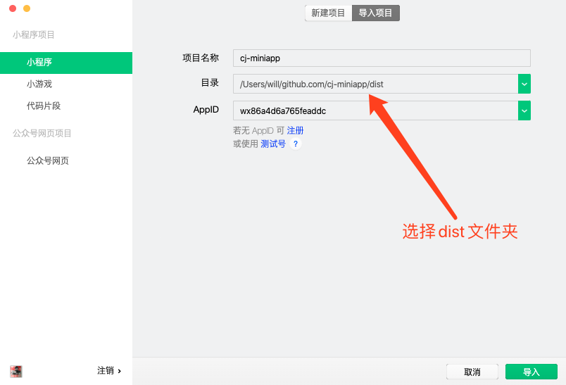
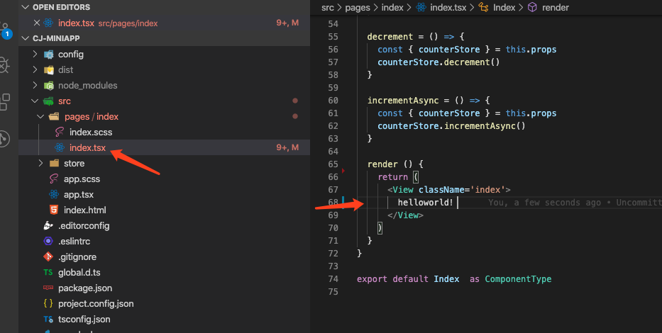

# 写在前面

这是一系列教程性质的实战演示，我希望通过这这个项目能让更多的同学理解什么是小程序，如何从0开始去完成一个商业性质的小程序项目。这个小程序的最终效果是一个群工具，目前第一个基础版本已经发布到了微信小程序，名字叫 “攒局” 有兴趣的同学可以去微信上搜索一下看看。由于我个人的美术功底比较差，所以界面比较粗糙，大家对这个产品有什么意见可以在下方留言。我会在后续的文章中逐步和大家分享我是如何一步步实现这个项目的。

# 技术栈
- 小程序端 taro, ts, mobx
- 服务器端 nodejs, ts, koa, sequelize, mysql

以上这些技术栈原则上来说我在项目中会直接使用其用法，有什么不明白的可以给我留言哈，我会根据留言情况看看是否给大家单个拿出来单个讲用法

# 工具
- 微信开发者工具: https://developers.weixin.qq.com/miniprogram/dev/devtools/download.html
- vscode: https://code.visualstudio.com/
  - eslint
  - prettier
- node: https://nodejs.org/en/
  - npm5.2+
- yarn: https://yarnpkg.com/
  
# 项目

## 创建项目

用taro的官方cli工具生成项目, 由于我们可能不止一个taro项目所以为了规避版本问题，建议大家使用npx的方式初始化项目，不要在全局安装cli工具。

``` 
npx @tarojs/cli init cj-miniapp

# Taro即将创建一个新项目!
# Need help? Go and open issue: https://github.com/NervJS/taro/issues/new
# ✔ 拉取远程模板仓库成功！
# ? 请输入项目介绍！ 攒局
# ? 是否需要使用 TypeScript ？ Yes
# ? 请选择 CSS 预处理器（Sass/Less/Stylus） Sass
# ? 请选择模板 mobx
```

等待执行完成后我们就能看到新生成的项目文件夹——cj-miniapp，进入之后目录结构如下：
```

├── config #构建配置文件夹
│   ├── dev.js
│   ├── index.js
│   └── prod.js
├── global.d.ts #ts声明文件
├── node_modules # 依赖模块
├── package.json
├── project.config.json
├── src #工作目录
│   ├── app.scss
│   ├── app.tsx
│   ├── index.html
│   ├── pages
│   └── store
├── tsconfig.json
└── yarn.lock
```

到这里我们已经有了一个基础项目结构，然后把整个项目添加到git代码库中方便管理后续的版本。

由于前文我们没有在全局安装cli工具这里运行整个项目之前我们需要在项目中安装@tarojs/cli 才能顺利启动整个项目

然后在项目根目录下运行

```
yarn add @tarojs/cli -D
yarn dev:weapp
```

编译完成后我们打开微信开发者工具，导入项目


填写AppID，没有小程序的同学在学习阶段也可以先选择使用测试号，完成后点击导入，我们就可以看到我们的第一个项目成功运行起来了


按照国际惯例，我们肯定需要将这个页面改成helloworld

打开vscode，导入项目





至此我们已经成功运行了我们的第一个小程序

从下一章开始我们将会改造一下我们的项目，并正式的开始我们小程序的开发

有兴趣的同学关注一下，每天都会有更新哦！